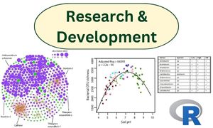
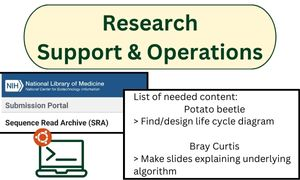
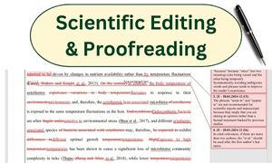

 
 

# My Mission

<b>Personalized solutions for individual needs.</b> 
I help you, the busy scientists, improve your productivity, make deadlines, and complete projects by allowing you to offload and delegate specialized tasks and projects to me.

 

# How It Works
1. Take a look below at the three areas in which I can provide my services.
2. <a href="../contact/index. html">Contact me</a> to discuss your needs.
3. We will agree on a personalized service offer that suits all your needs.
4. We will co-sign a simple contract so that you and I know what we can expect from each other in the most transparent way.
5. I will do the work and communicate with you and your team regularly.
6. I will send you an invoice at the agreed upon time(s) after completion of the service.
7. I hope that I can continue supporting you on future projects and tasks.  :smiley:

 

# Types of Services
Below is a list of ways in which I can support you.

Click on the icons below to jump to each topic or scroll down.

<a href="../contact/index.html">Contact</a> me to discuss your needs even if they are not listed below.
  

  

    
    
<a href="#R&D">Research and Development</a>

  

  

    
    
<a href="#Rsupport">Research Support and Operations</a>

  

  

    
    
<a href="#Editing">Scientific Editing and Proofreading</a>

  

 

  

~~~~~~~~~~~~~~~~~~~~~~~~~~~~~

  

## Research and Development
I have collaborated on numerous R&D projects, operated an Illumina sequencing facility, and maintained at institute's bioinformatics server platform. Therefore, I have hands-on experience with the entire workflow that many Big Data-related life science research projects go through. I provide my expertise in data analysis, NGS, and bioinformatics while having a thorough understanding of the impact that data collection methodology can have on both the data and the types of analytical approaches we use to pull out insightful information. Check out my research portfolio for my experiences in data analysis and visualization <a href="../portfolio/research/index.html">here</a>.

**I can...**
 

  

    

    <b>Collaborate on research projects</b>  
    I will bring my research experience and expertise to the table so that we can expand the scope of your research area.

  

  

    

    <b>Complete unfinished projects or help you start new projects</b> 
    When you have enough projects on your plate and have insufficient staff, I am your extra set of brains and hands to complete projects. If you lack in an expertise that I have, let me support you in getting new projects started.

  

  

    

    <b>Troubleshoot NGS data problems</b>  
    In some cases, your sequencing data does not look right or you are losing more data than you expect from your workflow. I have helped retrieved samples from sequencing projects that lost the barcode-sample matching lists and optimized QC workflows to retrieve more analyzable data.

  

 
**Methodologically, here are ways in which I can support your projects:**
 

  

    

    <b>Data Analysis</b>  
    I analyze your data using various statistical analysis methods in R and other bioinformatics tools.

  

  

    

    <b>Data Visualization</b>  
    I generate compelling graphs, diagrams, and tables that extract valuable insights from raw, noisy data.

  

  

    

    <b>Data Processing Pipelines</b>  
    I can help you automate data processing and analysis by writing scripts that are compatible in GNU Bash and R.

  

  

    

    <b>Reports and Manuscripts</b>  
    I will help you write the reports and manuscripts on the generated results. I can also finish the reports and manuscripts of data that you hadn't had time to finish.

  

  

~~~~~~~~~~~~~~~~~~~~~~~~~~~~~

  

## Research Support and Operations
I handle off-loadable tasks to alleviate your busy schedule, help make deadlines, and improve productivity and output. Below, I list some of the ways in which I have helped people in the past. You can also read more about my past experiences with research support <a href="../portfolio/research-operations/index.html">here</a>.
  

  

    

    <b>Operational Bioinformatics</b>  
    Data management, Submitting sequences to SRA, bio analysis software installation and troubleshooting, Easybuild and lmod setup and package library maintenance, NGS data QC, other bioinformatics issues on Ubuntu.

  

  

    

    <b>Content Writing</b>  
    Write & Polish user manuals, guides, and protocols. I can also speed up your work by handling part of the preparation and/or retrieval of content for reports, presentations, and teaching materials.

  

  

    

    <b>Science Operations</b>  
    I can handle the negotiating with vendors for sequencing and consumables for new projects and provide you with ready-to-use price offers (EU, CH, UK). I also complete miscellaneous offloadable tasks that are getting in the way of your meetings and other priorities.

  

  

~~~~~~~~~~~~~~~~~~~~~~~~~~~~~

  

## Scientific Editing and Proofreading
I have been working with individual colleagues as well as with an academic editing company to support non-native English-speaking scientists and improve their scientific documents, so that they can overcome the language barier, disseminate their research and ideas in high impact journals, and apply to presitigious agencies. In order to provide the best possible services and be able to showcase my expertise in editing, I also successfully completed the <a href="../portfolio/editing/index.html">Poynter ACES Editing Certificate</a> last year. As an editor, I strive for the "4 Cs": clarity, coherence, consisteny, and correctness

Below are the three main things I look out for in your written work:
  

  

    

    <b>Correct Language</b>  
    I will correct the linguistic mistakes that are present in your work. These include checking the grammar, spelling, and level of formality of the language. Awkward sentences will be rewritten, and the flow of the text can be improved. 

  

  

    

    <b>Check Format and Style</b>  
    If you know where you will be submitting your document to, I can check that the journal or agency house style is respected in your document. I mostly follow the CSE style guide, which is a scientific variant of CMOS. If you have very specific style preferences, I can accommodate your needs. I can edit in American and British English. Any other general formatting issues will also be checked and corrected.

  

  

    

    <b>Ensure Consistency</b>  
    Consistency in the use of fonts, punctuation marks, margins, abbreviations, terminology, and style are often overlooked. I will check all of the above to ensure that reading your document becomes a smooth experience for your target readers.

  

### Types of documents
I can work with many types of documents covering the life sciences:
* Reports
* Manuscripts
* Grant proposals
* Abstracts
* Cover letters
* Presentations
* Protocols
* Emails
* and more.

### Levels of editing
I provide two levels of editing, depending on the needs of your document.
  * **Standard Editing:** I will check for linguistic mistakes, formatting and style, consistency, and the flow within sentences.
  * **Substantive Editing:** In addition to everything in Standard Editing, I will also do a more in-depth editing work, including improvements in word usage and sentence structure. I will also check the quality of the flow throughout the manuscript, check for missing information and misplaced information, and point out any scientific issues I encounter.

### Pricing

|   Editing level  |     Price*     |
|------------------|:-------------:|
| Standard editing | 0.06 eur/word |
| Substantive editing | 0.09 eur/word |
| Editing top-up of documents requiring  a substantial amount of corrections\*\* | +0.02 eur/word |

\* The price excludes VAT. Businesses within Germany will be charged a 19% VAT. Businesses within the EU will be reverse charge. Businesses outside of the EU will be responsible for their own VAT. Individuals not affiliated with a business will be charged the German 19% VAT.

\*\* The word rate will be determined upon inspection of the document's writing quality. The top-up is to account for the extra time I will need to correct a very poorly written document. It is my experience that most documents are polished enough when handed to me that the top-up is not required.

    <h2>Document Price Calculator</h2>
     
    
Select editing level:

     
    

            <input type="radio" name="option" value="0.06" checked />
             &nbsp; Standard: &nbsp; 0.06 eur/word  
            <input type="radio" name="option" value="0.09" />
            &nbsp; Substantive: &nbsp; 0.09 eur/word  
            <input type="radio" name="option" value="0.08" />
            &nbsp; Standard + top-up: &nbsp; 0.08 eur/word  
            <input type="radio" name="option" value="0.11" />
            &nbsp; Substantive + top-up: &nbsp; 0.11 eur/word  
    

    
   <label for="wordCount">Number of Words in your document:</label>
   <input type="number" id="wordCount" placeholder="Enter number of words">
   

   <button onclick="calculatePrice()">Calculate Price</button>

   

 
 

<!-- EXCHANGERATES.ORG.UK Euros to Dollars CURRENCY CONVERSION START -->

	<a rel="nofollow" style="color:#FFFFFF;text-decoration:none;text-transform:uppercase;">Euros to Dollars</a>

<!-- EXCHANGERATES.ORG.UK Euros to Dollars CURRENCY CONVERSION END -->

