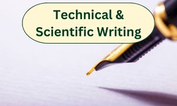
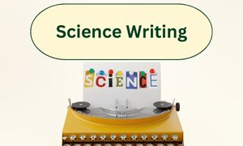
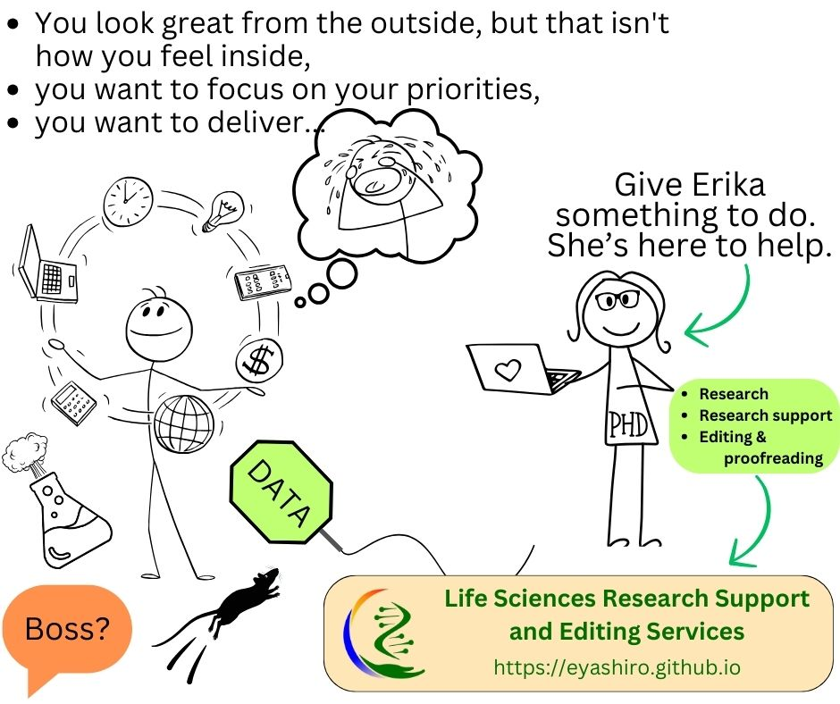
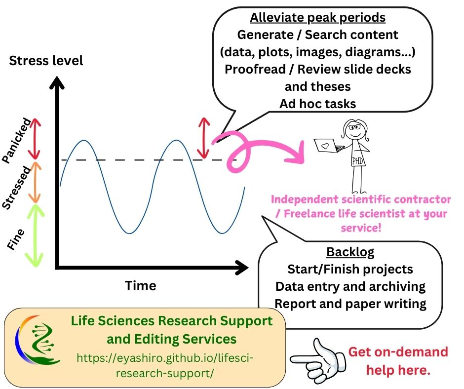

 
 

# My Mission

<b>Personalized solutions for individual needs.</b> 
I help you, the busy scientists, improve your productivity, make deadlines, and complete projects by allowing you to offload and delegate specialized tasks and projects to me.

 

# How It Works
1. Pick a service type.
2. <a href="../contact/index. html">Discuss your specific needs.</a>
3. Receive a personalized service offer that suits all your needs.
4. Agree to a simple contract so we know what to expect from each other in the most transparent way.
5. Get regular communication while work is in progress.
6. Receive the deliverables.
7. Pay the invoice after completion of each milestone or services.
8. Continue working together on future projects and tasks if satisfied.  &#128513;

 

# Types of Services
Here's a list of ways I can support you.

Click on the icons below to jump to each topic or scroll down.

<a href="../contact/index.html">Contact me</a> to discuss your needs even if they're not listed below. We all have different problems that needs solving.
  

  

    
    
<a href="#R&D">Research and Development</a>

  

  

    
    
<a href="#Rsupport">Research Support and Operations</a>

  

  

    
    
<a href="#Editing">Editing and Proofreading  
    (Scientific and General)</a>

  

  

    
    
<a href="#TechWriting">Technical and Scientific Writing</a>

  

  

    
    
<a href="#SciWriting">Science Writing</a>

  

  

    
    
<a href="#Consultations">Consultations</a>

  

 
#### !! Additional new services and consultations are available through the Menu's dropdown list !!

  

~~~~~~~~~~~~~~~~~~~~~~~~~~~~~

  

## Research and Development

I have collaborated on many R&D projects, operated an Illumina sequencing facility, and maintained an institute's bioinformatics server platform. All this hands-on experience has given me a solid understanding of the full workflow that many Big Data-driven life science research projects follow. I specialize in data analysis, NGS, and bioinformatics, with a strong grasp of how data collection methods shape both the data itself and the way we analyze to uncover insightful information.

Check out my research portfolio to learn about my experiences in data analysis and visualization <a href="../portfolio/research/index.html">here</a>. I'm also eager to learn new things!

#### I can...
 

  

    

    <b>Collaborate on research projects</b>  
    Bring in research experience and expertise to the table so you can expand the scope of your research area.

  

  

    

    <b>Complete unfinished projects or help you start new projects</b> 
    When you're overwhelmed with projects and lack staff, get an extra set of brains and hands to complete projects. If you need particular expertise, get the support you need to get new projects off the ground.

  

  

    

    <b>Troubleshoot NGS data problems</b>  
    Your sequencing data doesn't look right, or you're losing more data than expected from your workflow. I have helped clients retrieve lost barcode-sample matching lists and optimized QC workflows to retrieve more analyzable data.

  

 
#### Methodologically, I can support your projects as follows:
 

  

    

    <b>Data Analysis</b>  
    Get your data analyzed using various statistical analysis methods using R and other bioinformatics tools.

  

  

    

    <b>Data Visualization</b>  
    Have compelling graphs, diagrams, and tables generated that extract valuable insights from raw, noisy data.

  

  

    

    <b>Data Processing Pipelines</b>  
    Get the help you need to automate data processing and analysis through scripts that are compatible with R and GNU Bash.

  

  

    

    <b>Reports and Manuscripts</b>  
    Have your reports and manuscripts written so you can focus on moving other projects forward.

  

#### I can also polish what you've already written. Check out my <a href="index.html#Editing">editing and proofreading service</a>.
  
<a href="../contact/index.html">Contact me!</a>

<a href="#Top">Back to top</a>

  

~~~~~~~~~~~~~~~~~~~~~~~~~~~~~

  

## Research Support and Operations
What could you accomplish with two or more extra hours a week? 
~ Let's make it a reality!

Get on-demand help so your time is prioritized on core tasks that matter most.

Delegate off-loadable tasks to alleviate your busy schedule. Get the help you need to meet deadlines. Boost productivity and improve output!

Here are some examples. Read more about how clients and past employers were supported <a href="../portfolio/research-operations/index.html">here</a>.
  

  

    

    <b>Operational Bioinformatics</b>  
    Data management. Submitting sequences to SRA. Bio analysis software installation and troubleshooting. Easybuild and lmod setup and package library maintenance. NGS data QC, other bioinformatics issues on Ubuntu.

  

  

    

    <b>Content Writing</b>  
    Writing & Polishing user manuals, guides, and protocols. Retrieval and preparation of content for reports, slide decks, and teaching materials.

  

  

    

    <b>Science Operations</b>  
    Handle negotiations with vendors for sequencing and consumable prices and deliver ready-to-use price offers (EU, CH, UK). Data entry. Complete miscellaneous off-loadable tasks that are getting in the way of your meetings and other priorities.

  

 

 

  
<a href="../contact/index.html">Contact me!</a>

<a href="#Top">Back to top</a>

  

~~~~~~~~~~~~~~~~~~~~~~~~~~~~~

  

## Editing and Proofreading (Scientific + General)

Grammar mistakes and convoluted sentences kill your readers’ attention.

Get awkward sentences smoothed out, clarity improved, and ensure your writing meets stakeholder expectations and publication standards.

Overcome language barriers and communicate your messages effectively with expert editing and proofreading.

<a href="../portfolio/editing/index.html"> Click here</a> if interested in my editing credentials.

Here are three important things that will be carefully checked in your writing
  

  

    

    <b>Correct Language</b>  
    The service includes checking the grammar, spelling, and level of formality. Awkward sentences will be rewritten, and the flow of the text can be improved. 

  

  

    

    <b>Check Format and Style</b>  
    For research manuscripts and grants, compliance with the journal or agency's house style can be checked. I mostly follow the CSE and CMOS style guides. If you have very specific style preferences, feel free to let me know. Choose between American and British English spelling. 

  

  

    

    <b>Ensure Consistency</b>  
    Consistency in fonts, punctuation marks, margins, abbreviations, terminology, and style is often overlooked. These elements will be checked to ensure a smooth experience for your target readers.

  

### Types of documents
**Technical documents:** STEM and Clinical Sciences
* Reports
* Manuscripts
* White papers
* Grant proposals
* Doctoral and Master theses
* Conference abstracts
* Cover letters
* Applications (scholarships, fellowships, study programs)
* Presentations / Slide decks
* Protocols
* and more.

**Other document types:** General Topics
* Emails
* Webpages
* College application essays
* and more.

### Levels of editing

  * **Standard Editing:** Check for linguistic mistakes, formatting, style, consistency, and flow within sentences.
  * **Substantive Editing:** *Standard Editing* plus improve word usage, sentence structure, and flow throughout the manuscript. Detect missing and misplaced information. Point out any scientific issues I encounter.

Unless requested, the reference section of scientific documents is not checked because people normally use reference managers to format the references automatically.

### Pricing

|   Editing level  |     Price*     |
|------------------|:-------------:|
| Standard editing | 0.06 eur/word |
| Substantive editing | 0.09 eur/word |
| Editing top-up of documents requiring  a substantial amount of corrections\*\* | +0.02 eur/word |

\* The price excludes VAT. Businesses within Germany will be charged a 19% VAT. Businesses within the EU will be reverse charge. Businesses outside of the EU will be responsible for their own VAT. Individuals not affiliated with a business will be charged the German 19% VAT.

\*\* The word rate will be determined upon inspection of the document's writing quality. The top-up is to account for the extra time I will need to correct a very poorly written document. It is my experience that most documents are polished enough when handed to me that the top-up is not required.

 
<a href="../contact/index.html">Contact me!</a>

    <h2>Document Price Calculator</h2>
     
    
Select editing level:

     
    

            <input type="radio" name="option" value="0.06" checked />
             &nbsp; Standard: &nbsp; 0.06 eur/word  
            <input type="radio" name="option" value="0.09" />
            &nbsp; Substantive: &nbsp; 0.09 eur/word  
            <input type="radio" name="option" value="0.08" />
            &nbsp; Standard + top-up: &nbsp; 0.08 eur/word  
            <input type="radio" name="option" value="0.11" />
            &nbsp; Substantive + top-up: &nbsp; 0.11 eur/word  
    

    
   <label for="wordCount">Number of Words in your document:</label>
   <input type="number" id="wordCount" placeholder="Enter number of words">
   

   <button onclick="calculatePrice()">Calculate Price</button>

   

 
 

<a href="https://logwork.com/free-currency-converter-calculator" class="currency_convertor" data-currencies="EUR,USD,JPY,GBP,CNY,INR">Currency Converter</a>

<a href="#Top">Back to top</a>

  

~~~~~~~~~~~~~~~~~~~~~~~~~~~~~

  

## Technical and Scientific Writing
Do you have data but haven't had time to write the report or research article?

Do you need to compelling content to highlight your company's scientific and technical prowess?

Standardizing experimental procedures forms the foundation of good research practices, but who had time to write up the protocol?

#### Here are examples of what I can write:

 

  

    

    <b>Technical documents</b>  
    Experimental protocols 
    User manuals and how-to guides

  

  

    

    <b>B2B communication</b>  
    White papers 
    Research reports for stakeholders

  

  

    

    <b>Academic reports</b>  
    Manuscripts for peer-reviewed journals 
    Research reports for grant agencies

  

 
<a href="../contact/index.html">Contact me!</a>

<a href="#Top">Back to top</a>

  

~~~~~~~~~~~~~~~~~~~~~~~~~~~~~

  

## Science Writing

Making science and innovation accessible to broader audiences requires skills in science communication and storytelling.

Get web articles and educational materials written in plain English and maximize their impact on stakeholders, students, and the community!

Find examples of community articles under the RESOURCES tab in the menu.

Reach out if you'd like to have your own writer or ghostwriter!

 
<a href="../contact/index.html">Contact me!</a>

<a href="#Top">Back to top</a>

  

~~~~~~~~~~~~~~~~~~~~~~~~~~~~~

  

## Education: 1-on-1 Meetings

You can book 1-on-1 meetings to learn more about specific topics.

Bring your questions so you can ask a real person rather than LLMs.

Save time by asking someone who's already spent months (or years) surfing the internet, experiencing it all live, and asking people the same questions you have!

I recommend starting with the 30 minute package. Take your time to think about everything we discussed, and if you have more questions, book another meeting.

Check the dropdown Consultations menu above to book!

 
<a href="../contact/index.html">Contact me!</a>
