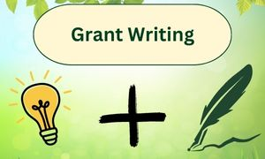
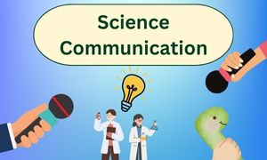

 
 

# Mission

<b>Personalized solutions for individual needs.</b> 
Help you improve your productivity, make deadlines, and complete projects by allowing you to offload and delegate specialized tasks and projects to me.

 

# How It Works

1. **Discovery:** We clarify goals, scope, timeline, rates, and confidentiality requirements.
2. **Proposal:** You get a clear plan with deliverables and milestones.
3. **Communication**: We regularly communicate updates and discuss the work in progress.
4. **Delivery:** You receive deliverables in a timely fashion accompanied by a detailed report.
5. **Follow-through:** Edits, revisions, and final polish as needed.

 

# Types of Services
Click on the icons below to jump to each topic or scroll down.

<a href="../contact/index.html">Contact me</a> to discuss your needs even if they're not listed below. We all have different problems that need solving.
  

  

    
    
<a href="#GrantWriting">Grant Writing</a>

  

  

    
    
<a href="#SciComm">Science Communication</a>

  

  

    
    
<a href="#Rsupport">Research Support and Operations</a>

  

  

~~~~~~~~~~~~~~~~~~~~~~~~~~~~~

  

## Grant Writing
### Value:
<ul class="emoji-marker">
  <li class="lightbulb">Write clear, persuasive, on-time grant applications. </li>
  <li class="lightbulb">Increase the quality and quantity of proposals submitted each year. </li>
  <li class="lightbulb">Increase funding success. </li>
</ul>

### Types of Deliverables:

#### Funding strategy and opportunity scoping:
<ul class="emoji-marker">
  <li class="ok">Grant scoping and shortlisting. </li>
  <li class="ok">Grant submission timeline planning </li>
</ul>

#### For smaller grants:
<ul class="emoji-marker">
  <li class="ok">Proposal strategy development. </li>
  <li class="ok">Narrative drafting and revisisions. </li>
  <li class="ok">Cover letter drafting. </li>
</ul>

#### For larger grants:
<ul class="emoji-marker">
  <li class="no">Consortium building. </li>
  <li class="ok">Scheduling proposal partner brainstorm sessions. </li>
  <li class="ok">Support with keeping project partners on schedule. </li>
  <li class="ok">Narrative drafting and revisions. </li>
  <li class="ok">Cover letter drafting. </li>
</ul>

### Who benefits?
<ul class="emoji-marker">
  <li class="pointright">Time-constrained scientists and PIs. </li>
  <li class="pointright">Start-ups and NGOs. </li>
  <li class="pointright">Early-career researchers. </li>
</ul>

### Learn More About These Services
* <a href="../../posts/grant-writing-and-consulting.html">Deep dive into Erika's grant writing and consulting services</a>
* <a href="https://medium.com/write-your-world/the-grant-writing-misconception-blocking-peoples-success-5e92d230ebec">The grant writing misconception blocking people's success</a>
* <a href="../../blog/writing-tips/">Grant writing tips</a>

 

  

      

        <a class="button0 button2" href="../../contact/index.html">Start A Project</a>
        <a class="button0 button2" href="../../services/">Explore Other Services</a>
      

  

  

<a href="#Top">Back to top</a>

  

~~~~~~~~~~~~~~~~~~~~~~~~~~~~~

  

## Science Communication
### Value:
<ul class="emoji-marker">
  <li class="lightbulb">Transform complex science into clear, accurate, and engaging writing. </li>
  <li class="lightbulb">Expert editing and proofreading for manuscripts and other documents to improve clarity, correctness, and impact. </li>
</ul>

### Types of Deliverables:
<ul class="emoji-marker">
  <li class="ok">For-the-public, plain-language summaries of technical reports and manuscripts. </li>
  <li class="ok">Press-friendly science web articles and outreach pieces. </li>
  <li class="ok">Editing and proofreading for STEM and clinical science documents (manuscripts, theses, reports, grant sections, etc.) </li>
</ul>

### Who Benefits:
<ul class="emoji-marker">
  <li class="pointright">Organizations needing public-facing content. </li>
  <li class="pointright">Researchers who want to share their work to broader audiences. </li>
  <li class="pointright">Non-native English authors who want polished, AI-free, impactful documents. </li>
</ul>

### Learn More About These Services
#### Science Communication
* <a href="../../blog/science-writing/index.html">Selection of past science writing projects</a> (Ghostwritten projects are not included.)

#### Editing and Proofreading
* <a href="../../portfolio/editing/index.html">Client testimonials and certifications.</a>
* <a href="../../posts/editing-rates-and-currency-calculator.html">Learn more about the service.</a>
* <a href="../../posts/editing-rates-and-currency-calculator.html#Price-Calculator">Rates and rate/currency calculator.</a>
* <a href="../../blog/writing-tips/">Writing tips</a>

 

  

      

        <a class="button0 button2" href="../../contact/index.html">Start A Project</a>
        <a class="button0 button2" href="../../services/">Explore Other Services</a>
      

  

  

<a href="#Top">Back to top</a>

  

~~~~~~~~~~~~~~~~~~~~~~~~~~~~~

  

## Research Support and Operations

 

  

    <h2>&#10132; Research Support</h2>
       
    <h3>Value:</h3>
      <ul class="emoji-marker">
      <li class="lightbulb">Finish research projects before funding runs out.</li>
      <li class="lightbulb">Transform incomplete analyses into figures, tables, and text that are ready for stakeholder evaluation. </li>
      </ul>
    <h3>Process and Deliverables:</h3>
      <ul class="emoji-marker">
      <li class="ok">Troubleshoot, analyze, and package biological results into clear figures, tables, and text for reports and manuscripts.</li></ul>
    <h3>Who Benefits:</h3>
    <ul class="emoji-marker">
      <li class="pointright">PIs and research scientists with stalled projects or complex projects requiring additional staff.</li>
      <li class="pointright">Teams needing reproducible research outputs and clear documentation.</li>
    </ul>
    <h3>Learn more about these Services</h3>
      <ul>
      <li><a href="../../portfolio/research">Selection of past research projects</a> (only open-access projects are shown)</li>
      <li><a href="../../portfolio/publications/">List of publications</a></li>
      <li><a href="../../portfolio/teaching/">Teaching experience</a></li>
      </ul>
  

  

    <h2>&#10132; Research Operations & On-Demand Support</h2> 
    <h3>Value:</h3>
      <ul class="emoji-marker">
      <li class="lightbulb"> Keep projects moving by delegating off-loadable tasks to lighten your busy schedule. </li>
      <li class="lightbulb"> Get on-demand help so your time is prioritized on core tasks that matter most. </li>
      <li class="lightbulb"> Boost productivity and improve output.</li>
      </ul>
    <h3>Process and Deliverables:</h3>
    <h4>Here are some examples:</h4>
      <ul class="emoji-marker">
      <li class="ok"> Complete research, technical, or administrative tasks (e.g., data entry, submission to SRA, etc.) </li>
      <li class="ok">Handle negotiations with vendors for NGS and consumable prices, and coordinate submission and delivery of NGS data. </li>
      <li class="ok">Handle ad hoc tasks (e.g., retrieve content for presentations and course materials, etc.). </li>
      <li class="portfolio">Check <a href="../../portfolio/research-operations/">my portfolio</a> for more examples</li>
      </ul>
    <h3>Who Benefits:</h3>
      <ul class="emoji-marker">
      <li class="pointright">Start-ups and SMEs that are over-stretched and in need of a versatile expert. </li>
      <li class="pointright">PIs and research teams who need an expert with a deep understanding of academic research workflows to help boost productivity. </li>
    </ul>
  

 

  

      

        <a class="button0 button2" href="../../contact/index.html">Start A Project</a>
        <a class="button0 button2" href="../../services/">Explore Other Services</a>
      

  

  

<a href="#Top">Back to top</a>

