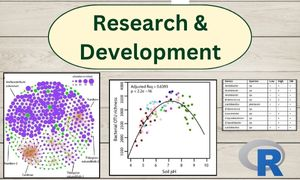
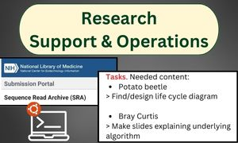
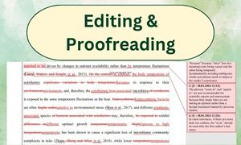

 
 

# My Mission

<b>Personalized solutions for individual needs.</b> 
I help you, the busy scientists, improve your productivity, make deadlines, and complete projects by allowing you to offload and delegate specialized tasks and projects to me.

 

# How It Works
1. Take a look below at the three areas in which I can provide my services.
2. <a href="../contact/index. html">Contact me</a> to discuss your needs.
3. We will agree on a personalized service offer that suits all your needs.
4. We will co-sign a simple contract so that you and I know what we can expect from each other in the most transparent way.
5. I will do the work and communicate with you and your team regularly.
6. I will send you an invoice at the agreed upon time(s) after completion of the service.
7. I hope that I can continue supporting you on future projects and tasks.  &#128513;

 

# Types of Services
Below is a list of ways in which I can support you.

Click on the icons below to jump to each topic or scroll down.

<a href="../contact/index.html">Contact me</a> to discuss your needs even if they are not listed below.
  

  

    
    
<a href="#R&D">Research and Development</a>

  

  

    
    
<a href="#Rsupport">Research Support and Operations</a>

  

  

    
    
<a href="#Editing">Scientific Editing and Proofreading</a>

  

 

  

~~~~~~~~~~~~~~~~~~~~~~~~~~~~~

  

## Research and Development
I have collaborated on numerous R&D projects, operated an Illumina sequencing facility, and maintained at institute's bioinformatics server platform. Therefore, I have hands-on experience with the entire workflow that many Big Data-related life science research projects go through. I provide my expertise in data analysis, NGS, and bioinformatics while having a thorough understanding of the impact that data collection methodology can have on both the data and the types of analytical approaches we use to pull out insightful information. Check out my research portfolio for my experiences in data analysis and visualization <a href="../portfolio/research/index.html">here</a>.

**I can...**
 

  

    

    <b>Collaborate on research projects</b>  
    I will bring my research experience and expertise to the table so that we can expand the scope of your research area.

  

  

    

    <b>Complete unfinished projects or help you start new projects</b> 
    When you have enough projects on your plate and have insufficient staff, I am your extra set of brains and hands to complete projects. If you lack in an expertise that I have, let me support you in getting new projects started.

  

  

    

    <b>Troubleshoot NGS data problems</b>  
    In some cases, your sequencing data does not look right or you are losing more data than you expect from your workflow. I have helped retrieved samples from sequencing projects that lost the barcode-sample matching lists and optimized QC workflows to retrieve more analyzable data.

  

 
**Methodologically, here are ways in which I can support your projects:**
 

  

    

    <b>Data Analysis</b>  
    I analyze your data using various statistical analysis methods in R and other bioinformatics tools.

  

  

    

    <b>Data Visualization</b>  
    I generate compelling graphs, diagrams, and tables that extract valuable insights from raw, noisy data.

  

  

    

    <b>Data Processing Pipelines</b>  
    I can help you automate data processing and analysis by writing scripts that are compatible in GNU Bash and R.

  

  

    

    <b>Reports and Manuscripts</b>  
    I will help you write the reports and manuscripts on the generated results. I can also finish the reports and manuscripts of data that you hadn't had time to finish.

  

  
<a href="../contact/index.html">Contact me!</a>

  

~~~~~~~~~~~~~~~~~~~~~~~~~~~~~

  

## Research Support and Operations
Delegate off-loadable tasks to alleviate your busy schedule. Get the help you need to meet deadlines. Boost productivity and improve output!

Here are some examples. Read more about how clients and past employers were supported <a href="../portfolio/research-operations/index.html">here</a>.
  

  

    

    <b>Operational Bioinformatics</b>  
    Data management. Submitting sequences to SRA. Bio analysis software installation and troubleshooting. Easybuild and lmod setup and package library maintenance. NGS data QC, other bioinformatics issues on Ubuntu.

  

  

    

    <b>Content Writing</b>  
    Writing & Polishing user manuals, guides, and protocols. Retrieval and preparation of content for reports, slide decks, and teaching materials.

  

  

    

    <b>Science Operations</b>  
    Handle negotiations with vendors for sequencing and consumable prices and deliver ready-to-use price offers (EU, CH, UK). Complete miscellaneous off-loadable tasks that are getting in the way of your meetings and other priorities.

  

  
<a href="../contact/index.html">Contact me!</a>

  

~~~~~~~~~~~~~~~~~~~~~~~~~~~~~

  

## Editing and Proofreading (Scientific + General)

Disseminate your ideas, attract customers, and apply to prestigious agencies in proper English!

Get your scientific and non-technical documents checked and polished. The goal is to help you overcome the language barrier and ensure that people will read, understand, and appreciate every bit of your writing.

<a href="../portfolio/editing/index.html"> Click here</a> if interested in my editing credentials.

Below are the three main things I look out for in your written work:
  

  

    

    <b>Correct Language</b>  
    The service includes checking the grammar, spelling, and level of formality. Awkward sentences will be rewritten, and the flow of the text can be improved. 

  

  

    

    <b>Check Format and Style</b>  
    For research manuscripts and grants, compliance with the journal or agency's house style can be checked. I mostly follow the CSE and CMOS style guides. If you have very specific style preferences, feel free to let me know. Choose between American and British English spelling. 

  

  

    

    <b>Ensure Consistency</b>  
    Consistency in fonts, punctuation marks, margins, abbreviations, terminology, and style is often overlooked. These elements will be checked to ensure a smooth experience for your target readers.

  

### Types of documents
**Technical documents:** STEM and clinical sciences
* Reports
* Manuscripts
* White papers
* Grant proposals
* Doctoral and Master theses
* Conference abstracts
* Cover letters
* Applications (scholarships, fellowships, study programs)
* Presentations / Slide decks
* Protocols
* and more.

**Other document types:**
* Emails
* Webpages
* College application essays
* and more.

### Levels of editing

  * **Standard Editing:** Check for linguistic mistakes, formatting, style, consistency, and flow within sentences.
  * **Substantive Editing:** *Standard Editing* plus improve word usage, sentence structure, and flow throughout the manuscript. Detect missing and misplaced information. Point out any scientific issues I encounter.

Unless requested, the reference section of scientific documents is not checked because people normally use reference managers to format the references automatically.

### Pricing

|   Editing level  |     Price*     |
|------------------|:-------------:|
| Standard editing | 0.06 eur/word |
| Substantive editing | 0.09 eur/word |
| Editing top-up of documents requiring  a substantial amount of corrections\*\* | +0.02 eur/word |

\* The price excludes VAT. Businesses within Germany will be charged a 19% VAT. Businesses within the EU will be reverse charge. Businesses outside of the EU will be responsible for their own VAT. Individuals not affiliated with a business will be charged the German 19% VAT.

\*\* The word rate will be determined upon inspection of the document's writing quality. The top-up is to account for the extra time I will need to correct a very poorly written document. It is my experience that most documents are polished enough when handed to me that the top-up is not required.

 
<a href="../contact/index.html">Contact me!</a>

    <h2>Document Price Calculator</h2>
     
    
Select editing level:

     
    

            <input type="radio" name="option" value="0.06" checked />
             &nbsp; Standard: &nbsp; 0.06 eur/word  
            <input type="radio" name="option" value="0.09" />
            &nbsp; Substantive: &nbsp; 0.09 eur/word  
            <input type="radio" name="option" value="0.08" />
            &nbsp; Standard + top-up: &nbsp; 0.08 eur/word  
            <input type="radio" name="option" value="0.11" />
            &nbsp; Substantive + top-up: &nbsp; 0.11 eur/word  
    

    
   <label for="wordCount">Number of Words in your document:</label>
   <input type="number" id="wordCount" placeholder="Enter number of words">
   

   <button onclick="calculatePrice()">Calculate Price</button>

   

 
 

<a href="https://logwork.com/free-currency-converter-calculator" class="currency_convertor" data-currencies="EUR,USD,JPY,GBP,CNY,INR">Currency Converter</a>

